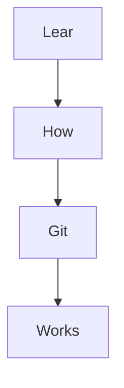
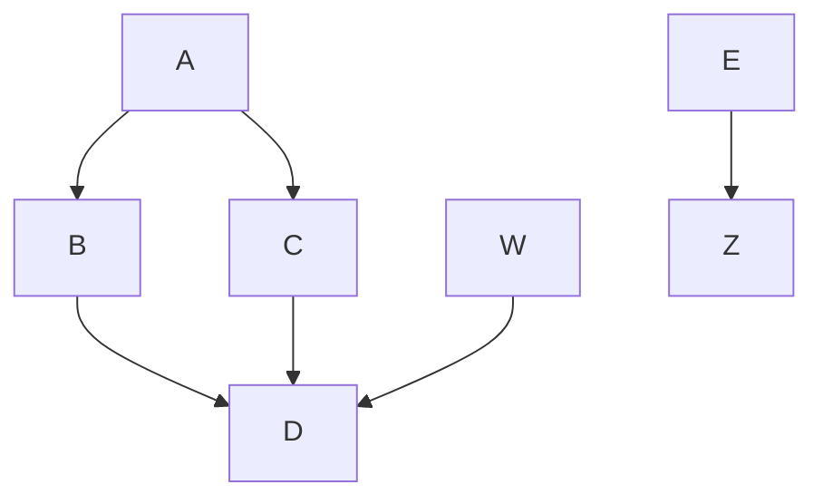

# Test this outaadwafwafw

Here is an inline mermaid filetest

<!-- generated by mermaid compile action - START -->

  
Mermaid markup

<!-- generated by mermaid compile action - END -->

Goal: comment out the above, insert image ref

<!-- generated by mermaid compile action - START -->

  
Mermaid markup

<!-- generated by mermaid compile action - END -->
